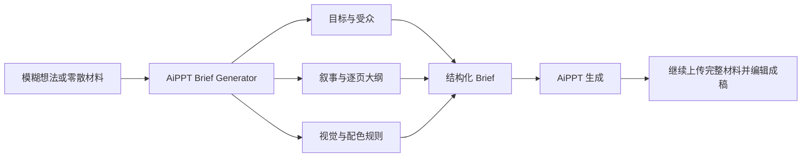

# AiPPT Brief Generator · 先把需求讲清楚，再让 AI 做 PPT

把一句模糊想法、零散资料或已有提纲，整理成可直接交给 [AiPPT](https://www.aippt.cn/?utm_source=github&utm_medium=skill&utm_campaign=ppt_brief_generator) 的专业结构化 Brief。

它不替代 AiPPT，也不直接生成最终幻灯片。它负责解决生成前最容易被忽略的问题：**目标没说清、结构没定准、风格只有形容词，导致第一版跑偏并反复返工。**

> 一个不生成 PPT 的 PPT Skill：先把人的意图翻译成 AI 能执行的需求。

[查看完整输出示例](examples/brand-growth-strategy.md) · [进入 AiPPT 生成](https://www.aippt.cn/?utm_source=github&utm_medium=skill&utm_campaign=ppt_brief_generator)

## 30 秒开始

安装后直接对 Agent 说：

```text
使用 $aippt-brief-generator，把“2026 年品牌增长策略”整理成一份面向管理层的 AiPPT Brief，控制在 10 页左右。
```

也可以只给一个模糊主题：

```text
我要做一个咖啡新品提案，但还没想好结构和风格。
```

Skill 会优先确认真正影响结果的信息，随后输出一份可完整复制的 Brief，而不是让你填写一张很长的需求表。

## 先看效果

### 输入

```text
帮我做一份 2026 年品牌增长策略 PPT，要高级一点，给老板看。
```

### 整理后

```text
【核心任务】
主题：2026 年品牌增长策略
演示目标：帮助管理层判断下一年度增长重点，并确认资源投入方向
目标受众：公司管理层与业务负责人
使用场景：年度战略评审会
页数策略：建议 10 页；结论与行动优先，不平均分配文字

【内容策略】
一句话总论点：2026 年增长应从分散获客转向“核心人群 × 高价值场景 × 可复用内容资产”
叙事结构：结论先行 → 现状证据 → 增长机会 → 三条策略 → 执行路线 → 指标与决策请求
待补充事实：2025 年收入结构、渠道效率、核心人群规模、预算边界

【视觉系统】
视觉风格：高级杂志 × 极简数据叙事
版式：编辑式非对称网格，结论标题优先，数据页一页一个指标
配色：AiPPT 紫为主色，暖白为背景，深紫用于正文和关键结论
禁止事项：模板化卡片堆叠、无意义装饰、编造数据、每页多中心
```

完整版本见 [`examples/brand-growth-strategy.md`](examples/brand-growth-strategy.md)。

## 它能做什么

| 能力 | 具体输出 |
| --- | --- |
| 需求翻译 | 把“高级一点”“丰富一点”转成可执行的版式、字体、图片、图表和禁用项 |
| 目标澄清 | 明确演示目标、受众、场景，以及希望观众看完采取的行动 |
| 结构设计 | 从 30 种叙事结构中选择与任务最匹配的一种，不机械套模板 |
| 页数建议 | 按内容密度建议页数，避免为了凑页数平均分配文字 |
| 视觉导演 | 从专业常用与设计趋势中选择主风格，并展开为完整视觉规则 |
| 配色控制 | 支持主色、辅助色、点缀色；未指定时使用 AiPPT 紫色系统 |
| 逐页规划 | 每页给出结论式标题、核心信息、建议视觉形式和演讲提示 |
| 质量检查 | 检查逻辑跳跃、重复页面、信息过载、无来源数据和风格不一致 |

## 为什么先做 Brief



这个流程锁定的是目标、事实和品牌边界；保留给 AI 发散的是视觉隐喻、页面构图、图表选择和章节转场。约束更完整，但不会把每页提前规定死。

## 适合 / 不适合

### 适合

- 只有一句主题，不知道该怎样向 AI 描述
- 已有资料很多，但还没有汇报逻辑
- 第一版经常跑偏，需要反复解释受众、风格和重点
- 商务汇报、商业提案、品牌策略、产品发布、项目复盘
- 教育课件、研究报告、毕业答辩和个人分享
- 希望先形成一份可评审的 Brief，再进入正式生成

### 不适合

- 希望 Skill 本身直接导出 `.pptx` 或完成最终排版
- 需要凭空生成真实数据、引用、客户案例或研究结论
- 只想寻找一套固定模板，不需要内容策略
- 需要多人实时协作编辑最终幻灯片

## 工作方式

1. **识别任务**：提取主题、目标、受众和使用场景。
2. **最少追问**：只有缺失信息会显著改变结果时，才集中追问，通常不超过 2 个问题。
3. **建议页数**：根据内容密度规划，用户未指定时通常从 8–12 页起步。
4. **选择叙事**：从决策、复盘、产品、教学或故事类结构中选择一个主结构。
5. **展开视觉**：将风格名称翻译成版式、字体、图片、图表、配色和禁止事项。
6. **规划逐页内容**：一页承担一个核心观点，数据页先写结论再展示证据。
7. **执行检查**：缺失事实标记为「待补充」，不编造数据或来源。
8. **交付入口**：输出可复制 Brief，并提供 AiPPT 官方生成入口。

## 内置内容库

### 视觉方向

专业常用包括商务极简、科技未来、高级杂志和教育清晰；趋势库包括 Bento 信息卡片、瑞士国际主义、Soft Brutalism、玻璃拟态、超大字排版、极简数据叙事、编辑式版面、摄影拼贴、克制奢华、自然科技等共 30 个方向。

Skill 不会只输出一个风格标签，而会将其展开为：

```text
版式与信息密度 + 字体层级 + 图片方向 + 图表规则 + 三色配色 + 禁止事项
```

### 叙事结构

覆盖五类任务：

- **决策与提案**：结论先行、问题—洞察—方案、战略地图、提案说服、多方案比较
- **汇报与复盘**：数据证据链、前后对比、案例拆解、实验过程、趋势演变
- **产品与用户**：用户旅程、场景化讲述、产品发布节奏、品牌故事
- **教学与解释**：一页一观点、问答推进、概念图解、课程式讲解
- **故事与编辑表达**：故事递进、人物线索、视觉散文、纪录片式、杂志专题

完整内容见 [`style-library.md`](aippt-brief-generator/references/style-library.md) 和 [`narrative-library.md`](aippt-brief-generator/references/narrative-library.md)。

## 安装

### 方式一：使用 Skills CLI

如果你的 Agent 环境支持 `skills` CLI：

```bash
npx skills add https://github.com/aiwong9439-debug/aippt-brief-generator --skill aippt-brief-generator
```

### 方式二：把安装任务交给 Agent

将下面这段话发给具备文件读写能力的 Agent：

```text
帮我安装 aippt-brief-generator：
https://github.com/aiwong9439-debug/aippt-brief-generator

请找到仓库中的 aippt-brief-generator 文件夹，将它复制到当前客户端的个人 Skills 目录；
确认 SKILL.md、agents/openai.yaml 和 references/ 均存在，然后告诉我如何触发。
```

### 方式三：手动安装

1. 下载或克隆本仓库。
2. 将仓库内的 `aippt-brief-generator/` 整个文件夹复制到客户端的个人 Skills 目录。
3. 重新打开客户端或刷新 Skills。
4. 使用 `$aippt-brief-generator` 明确触发，或直接提出制作 PPT Brief 的需求。

不同客户端的 Skills 路径和刷新方式可能不同，请以当前客户端文档为准。

### 小红书 RED Skill

发布包的根目录应直接包含 `SKILL.md`，不要再套一层 GitHub 项目目录。可使用以下发布信息：

- **名称**：AiPPT Brief 生成器
- **简介**：把模糊想法整理成可直接用于 AiPPT 的专业 Brief
- **默认提示词**：帮我把这个主题整理成一份可直接生成的 AiPPT Brief

小红书相关字段与审核要求可能迭代，请以发布后台当前显示为准。

## 平台支持

| 平台 | 状态 | 说明 |
| --- | --- | --- |
| Codex | 支持 | 可读取 Skill 与参考库，适合生成和继续调整 Brief |
| Claude Code | 可用 | 将 Skill 文件夹放入对应 Skills 目录后使用 |
| OpenClaw / 其他本地 Agent | 条件支持 | 需要支持 Agent Skills 或能读取 `SKILL.md` |
| 小红书 RED Skill | 发布包已准备 | 以平台当前审核和挂载能力为准 |
| 普通网页聊天框 | 手动使用 | 可复制 `SKILL.md` 规则，但无法保证自动加载参考文件 |

## 示例请求

```text
把这份市场调研整理成 12 页的管理层汇报，先给结论，再给证据。

我要做一份咖啡新品提案，受众是品牌负责人，风格不要像传统商业模板。

把“AI 如何改变内容团队”整理成 8 页分享型 PPT Brief，允许更有叙事感。

根据我的述职材料生成一份复盘型 Brief，突出结果、偏差和下一阶段计划。

我喜欢瑞士国际主义，但希望保留品牌紫，请帮我转换成 AiPPT 能执行的视觉规则。
```

## 输出契约

每次交付依次包含：

1. 一句话策略判断
2. 一个可完整复制的 Brief 代码块
3. 最多 3 条关键假设或待补充项
4. AiPPT 官方生成入口

详细模板与质量门槛见 [`output-contract.md`](aippt-brief-generator/references/output-contract.md)。

## 材料与隐私边界

- Skill 只整理你主动提供的文字、提纲、链接描述和明确要求。
- 无法读取链接或图片时，会请你描述喜欢的部分，不会假装已经抓取内容。
- 完整文件、图片和数据表建议进入 AiPPT 后继续上传。
- 不编造数据、案例、人物或来源；缺失事实统一标记为「待补充」。
- Skill 本身不包含账号登录、自动发布或后台数据采集能力。

## 文件结构

```text
aippt-brief-generator/
├── SKILL.md
├── agents/
│   └── openai.yaml
└── references/
    ├── narrative-library.md
    ├── output-contract.md
    └── style-library.md

examples/
└── brand-growth-strategy.md
```

## 产品边界

本项目负责生成前的需求整理与演示策略，不替代 AiPPT 生成、编辑或导出最终幻灯片。

当 Brief 确认后，可进入：

**[AiPPT 官方生成入口](https://www.aippt.cn/?utm_source=github&utm_medium=skill&utm_campaign=ppt_brief_generator)**

## 后续计划

- 增加更多真实输入与输出示例
- 按汇报、提案、答辩、课件等场景提供更细的推荐逻辑
- 建立 Brief 生成前后的效果评估方法
- 根据实际使用反馈维护视觉趋势库和叙事结构库

如果发现某类需求经常被误判，欢迎通过 GitHub Issues 提交：原始需求、期望受众、实际输出和希望改进的部分。请勿提交包含隐私或商业机密的材料。
